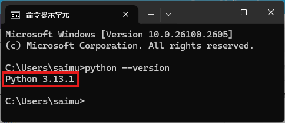
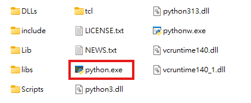
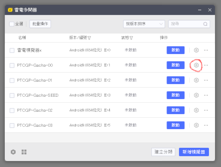
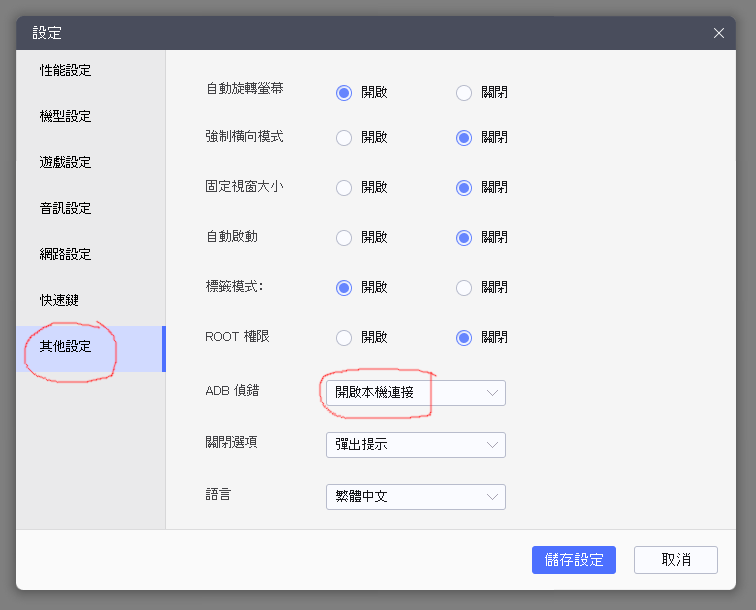

# FAQ

## .\venv\Scripts\activate.bat 出現錯誤

首先輸入
<pre>python --version</pre>
正常情況下應該是這樣

如果出現錯誤，那可能是：

- 沒有安裝 [Python](https://www.python.org/)
- 安裝 Python 時沒有登錄到系統

如果 Python 已經安裝了，那麼先確認 Python 的安裝資料夾，大約是這個樣子。

例如 Python 安裝位置在 C:\\Users\\User\\AppData\\Local\\Microsoft\\WindowsApps 的話，就如此執行。

<pre>
C:\Users\User\AppData\Local\Microsoft\WindowsApps\python.exe -m venv venv
.\venv\Scripts\activate.bat
</pre>

成功後，就繼續餘下的步驟。

## 出現 OIADLYZHXI OLEATIUZMY 的循環

<pre>
2024-12-20 07:41:12,867 DEBUG OIADLYZHXI pidof returncode = 1
2024-12-20 07:41:18,831 DEBUG OLEATIUZMY runapp returncode = 0
2024-12-20 07:41:23,856 DEBUG OIADLYZHXI pidof returncode = 1
2024-12-20 07:41:26,420 DEBUG OLEATIUZMY runapp returncode = 0
2024-12-20 07:41:31,446 DEBUG OIADLYZHXI pidof returncode = 1
2024-12-20 07:41:34,039 DEBUG OLEATIUZMY runapp returncode = 0
2024-12-20 07:41:39,061 DEBUG OIADLYZHXI pidof returncode = 1
2024-12-20 07:41:40,695 DEBUG OLEATIUZMY runapp returncode = 0
</pre>

檢查 adb 設定

## 如何令程式只停在神包上？

參考 config-god-pack.yaml 的設定。
- TARGET_CARD_LIST 設為空列 []
- STOP_AT_RARE_PACK 設為 true

## 如何多開？

可以執行多個 ptcgp-gacha-loop 實現

1. 下載第二個 ptcgp-gacha-loop
2. 在該資料夾的 config.yaml ，把 LD_EMU_NAME 設為另一個模擬器的名稱
3. 同時執行新舊 ptcgp-gacha-loop
